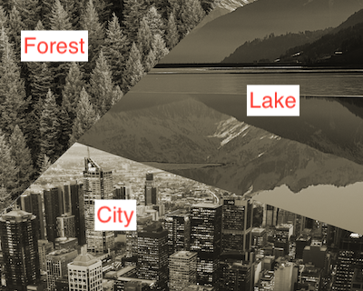
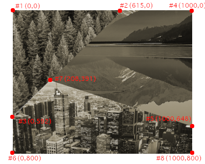

# React Native Polygonal Menu

### Display and handle clicks on menus composed of non-rectangular buttons

Imagine an image consisting of 3 parts (we'll call them _regions_ here): a forest, a lake, and a city. The idea of the `<PolygonalMenu>` component is to detect clicks on each region and let the main program handle the user choice.


#### Installation

`npm i react-native-polygonal-menu`

#### Basic usage

1. Get a background image composed of several regions



2. Using a graphics tool (e.g. GIMP), determine the positions of the
   edges of the polygonal buttons in your menu and store them as array of vertices.

   NOTE: the coordinates of the vertices should be given in the units of the original image (pixels).



For example, in our case, the borders of the forest regions form a triangle made of point #1, #2 and #3, while the borders of the lake are the segments between points #2, #4, #5 and #7.

Now we can create the regions object like in [the example](example/src/regions.ts):

```typescript
const regions = {
  forest: [ { x: 0, y: 0 }, { x: 615, y: 0 }, { x: 0, y: 592 } ],
  // lake: ...
  // city: ...
```

3. Insert the `<PolygonalMenu>` component into your app

```typescript
<PolygonalMenu
  regions={regions}
  backgroundImage={require('../assets/main-background.png')}
  onSelectRegion={handleSelect}
>
  // Insert any overlaying elements here...
</PolygonalMenu>
```

This will call `handleSelect(region: string)` each time a user clicks inside a region.

#### Highlight the currently selected region

PolygonalMenu also supports automatically highlighting the selected part of the screen, assuming we provide properly clipped transparent PNGs with only the highlighted sections. The highlighted sections images must be same size as the original image.

```typescript
const HIGHLIGHTED_IMGS = {
  forest: require('../assets/forest_high.png'),
  // The keys must match the region names
}

<PolygonalMenu
  regions={regions}
  backgroundImage={require('../assets/main-background.png')}
  highlightedRegions={HIGHLIGHTED_IMGS}
  onSelectRegion={handleSelect}
/>
```

#### Notes / Caveats

- **Make sure your base image is wide enough to cover the entire width of the rendered area.** The region detection algorithm currently doesn't support menus based on vertically cropped images.
- You can pass `height` and/or `width` as optional props to the `<PolygonalMenu>` component. If these values are not defined, the module assumes we want to use `{flex: 1}` to fill the whole available space.
- The regions must not overlap each other. They can share some vertices (like in the example), or be separated - in this case, the `onSelectRegion` callback will receive `"_notFound"` as the argument.

#### Thanks

I used [RN Module Template](https://github.com/demchenkoalex/react-native-module-template) to create this module.

Sample photos from [Pexels](http://pexels.com): city - Maxime Francis, forest - Matthew Montrone, lake - Bri Schneiter.
